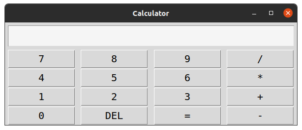

# PyCalc

A simple calculator using Python3 and TKinter

## Requirements
-----------------
* Python3
* Tkinter

## How run
----------------------
First download this repository, then open the terminal of your operating system, go to the folder who contains the project and run

* Linux 
```bash
$ python3 main.py
```
* Windows
```bash
$ python main.py
```
## Preview


## Features to Implement
---------------------
* ~~Sum of two or more numbers~~
* ~~Substract of two or more numbers~~
* ~~Multiply of two or more numbers~~
* ~~Division of two numbers~~
* Combined Operations
* Operations with floats

